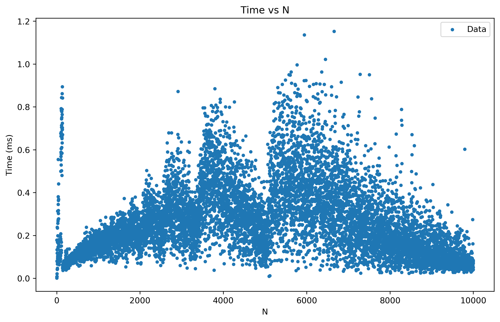
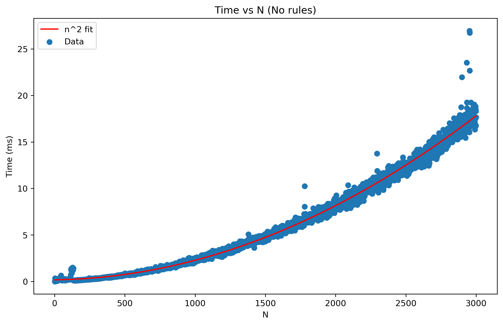
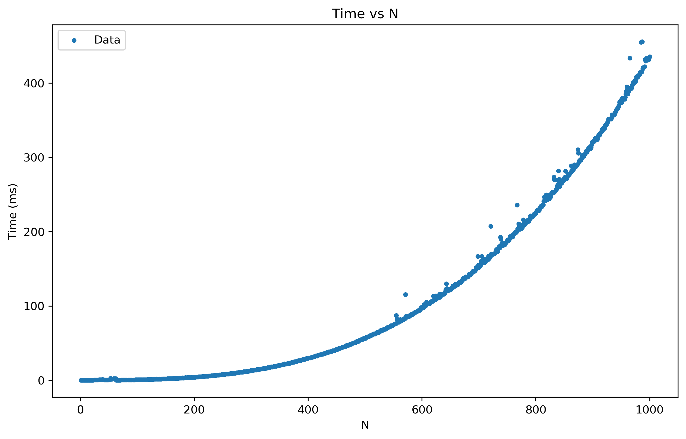

# Proyecto 1 - Diseño y análisis de algoritmos
**Realizado por:**

- Juan David Guevara Arévalo - 202116875
- Jose David Martínez Oliveros - 202116677

## 1. Algoritmo de solución
Para solucionar el problema, se decidió abordarlo en 3 etapas:

1. Determinar un algoritmo para ordenar las torres (sin pensar en hacerlo de la mejor forma)
2. Mejorar el algoritmo para obtener la menor cantidad de pasos.
3. Optimizar el algoritmo para reducir el tiempo de ejecución.

### 1.1. Determinar un algoritmo para solucionar el problema
Para llegar a un algoritmo, se planteo la situación más pequeña posible (donde tan solo hay 2 torres) y planteamos una ecuación de recurrencia que solucionaría dicha situación.
La ecuación encontrada es la siguiente:
```
dp[i] = dp[i] + ceil((dp[i + 1] - dp[i]) / 2) if dp[i + 1] > dp[i]
dp[i + 1] = dp[i + 1] - ceil((dp[i + 1] - dp[i]) / 2) if dp[i + 1] > dp[i]
```
La anterior ecuación, aumenta la torre $i$ la cantidad de pasos requeridos, a la vez que decrementa la torre $i+1$.

Sin embargo, para completar el algoritmo, es necesario iterar (*Mover $i$*) correctamente para conseguir un método funcional.
Para ello, identificamos el caso en el que hay 3 torres, y se está revisando la torre del medio. Una vez aplicada la ecuación, es necesario revisar que la torre del medio siga siendo más alta o igual que la anterior, si no lo es, se decrementa $i$, de lo contrario se incrementa.

Con dicha estrategia, el algoritmo ya ordena las torres correctamente.

### 1.2. Obtener la menor cantidad de pasos
Dado que a una torre es posible ponerle fichas de cualquier torre adyacente, es necesario actualizar el algoritmo para que tome las fichas del mejor lado y no solo de la izquierda. Para ello, es necesario calcular la diferencia de altitud entre las torre $i$ e $i + 1$, y ver si podemos obtener dicha cantidad de la torre izquierda sin hacerla más pequeña que la altura objetivo. Esto asegura que, de ser posible, nivelaremos la torre actual asegurando que siga siendo menor o igual a la de la izquierda.
La ecuación de recurrencia final sería la siguiente:
```
diff = dp[i + 1] - dp[i] # Por simplicidad

dp[i] = dp[i] if i == n - 1 or diff <= 0
dp[i] = dp[i] + ceil(diff / 2) if i == 0 or floor((dp[i-1] - dp[i]) / 2) < diff
dp[i] = dp[i] + min(floor((dp[i-1] - dp[i]) / 2), diff)
```
*Por simplicidad se omitió la actualización de $dp[i - 1]$ y $dp[i + 1]$ respectivamente.*

Implementando la anterior ecuación, las torres no solo terminarán en el orden correcto, sino que el proceso se realizará en la menor cantidad de pasos posibles. *Solución final del proyecto.*

### 1.3. Optimización
*A partir de aquí la implementación en código se aleja un poco de la ecuación de recurrencia definida, sin embargo, sigue la misma estrategia de tomar de la izquierda si es posible, de lo contrario de la derecha.*

Para optimizar el algoritmo fue necesario reducir considerablemente la cantidad de iteraciones realizadas. Para ello se enfrentaron 2 problemas:

- Agilizar la cantidad de iteraciones requeridas para ordenar casos sencillos.
- Identificar desde que punto las torres tienen el mismo tamaño

El primer punto fue sencillo, ya que es fácil saber como deben quedar las torres si hay $N$ torres seguidas del mismo tamaño $n$ y luego aparece una torre de altura $n + k$.

```
      N
 |----------|                
|            #|            |             |
|            #|     ->     |##           |
|#############|            |#############|
Donde la altura n es 1, y la diferencia k es 2.
```

Tras varias pruebas, la formula identificada para calcular la cantidad de pasos necesarios para ordenar el caso descrito fue la siguiente:

$B = \frac{k}{N}$ *\ \ Tomando únicamente la parte entera*

$r = k - B\cdot N$ *\ \ Es el residuo de dividir $k$ entre $N$*

$R = N - r$ *\ \ La cantidad de pasos que hay que restar*

$steps = \frac{1}{2}N(B + 1)(N+1) - \frac{1}{2}R(R+1)$

Con la disponibilidad de esta formula, lo único que resta es hacer un traqueo correcto de la posición desde la que hay una región aplanada para identificar $N$ de forma adecuada.

Para ello, se creó una variable auxiliar con el objetivo de guardar la posición desde la cual hay torres del mismo tamaño seguidas. La forma de aumentar el valor de dicha variable es sencilla, pues si en el recorrido actual de las torres la siguiente es más baja, se aumenta el valor de dicha variable, de lo contrario no se modifica.

Cabe resaltar que una vez se actualizan las torres, es necesario re-calcular el valor de la variable, lo cuál es sencillo en el caso $N > k$, de lo contrario, simplemente $i$ se actualiza con valor 0.

*Para mejorar aún más la complejidad temporal en lugar de utilizar una variable, se puede utilizar una cola en la que se van guardando las posiciones, pero se empieza a sacrificar memoria y la diferencia no es tan significativa.*

## 2. Análisis de complejidades espacial y temporal

### 2.1. Complejidad temporal

**Mejor caso**

Tras las optimizaciones, el algoritmo tiene dos casos donde la complejidad será $O(n)$.

1. El primero, y obvio, es cuando todas las torres están ordenadas y la complejidad exacta es $\ T(n) = n$ ya que no se realiza ninguna operación.
2. El segundo, es cuando hay torres que están precedidas por una menos alta, pero tienen una región aplanada de superficie mayor o igual a la diferencia de altitud de dicha torre. Esto se debe a que podemos organizar fácilmente utilizando la formula presentada con anterioridad, sin reiniciar la variable $i$ a $0$, por lo que la complejidad exacta es $\ T(n) = 2n$ por lo que la complejidad seguirá siendo $O(n)$

**Caso Promedio**

Estimar la complejidad promedio puede ser una tarea difícil, sin embargo, por la naturaleza del problema, donde la suma de las alturas de las torres es menor a 10000, y la cantidad máxima de las torres también es 10000, la mayoría de casos tendrán una buena cantidad de regiones aplanadas. Por lo que el código, si bien no es $\ T(n) = n$, es $\ T(n) = k\cdot n$ donde $k$ es lo suficientemente pequeño para considerar que sigue teniendo una complejidad $O(n)$

***Ver [Anexo 1](#anexo-1)**; una gráfica del tiempo en milésimas de segundo que le toma al algoritmo solucionar para $N$ torres, donde se cumplen las restricciones de los datos de entrada.*

Es posible evidenciar, que si bien la gráfica no tiene una tendencia clara, los picos tienen un crecimiento lineal (cada vez los picos son mayores), esto se debe a que a medida que aumenta la cantidad de datos, existen algunos puntos de inflexión que permiten utilizar una menor cantidad de veces la estrategia de utilizar las zonas llanas, pero claramente, cuanto más crezca la cantidad de torres, si se mantiene la restricción de que los elementos no pueden sumar más de 10000, la complejidad del algoritmo se estabilizará en $\ T(n) = n$.

**Peor caso**

Para estimar la complejidad temporal en el peor de los casos, será necesario ignorar las restricciones que tienen los datos. Y para ello, se analizaron 2 escenarios y se estimó una complejidad temporal $O(n^2)$.

**1. Torres entre 0 y 10000 sin la restricción de la suma:**
En este caso, se utilizó un script de Python para producir entradas completamente aleatorias, lo que hará que el algoritmo tenga que reiniciar o decrementar una amplia cantidad de veces el iterador $i$. ***Ver [Anexo 2](#anexo-2)*** Una gráfica donde se evidencia el resultado. *Nótese que aún así, el algoritmo maneja un excelente tiempo de ejecución.*

**2. Torres con altitud cuadrática:**
Para este caso, con el objetivo de poner en las peores circunstancias al algoritmo (ya que en esta circunstancias la gran mayoría de las veces el algoritmo retrocederá hasta $i=0$ en cada torre) se creó un conjunto de datos en el que la altura de cada torre, es la posición de la misma elevada al cuadrado, está vez, es mucho más sencillo notar el crecimiento cuadrático del tiempo. ***Ver [Anexo 3](#anexo-3)***

Tras estos análisis, se puede concluir que la complejidad temporal del algoritmo es $\ O(n)$ para la mayoría de casos dadas las precondiciones definidas, sin embargo, sí se tienen en cuenta casos más generales que no cumplan las precondiciones, la complejidad temporal sería $O(n^2)$.

### 2.2. Complejidad espacial
La complejidad espacial del algoritmo es $O(1)$, pues para la ejecución del mismo, no se maneja ningún arreglo auxiliar. Todas las operaciones se realizan sobre el arreglo de entrada.

## 3. Escenarios
### 3.1. En un movimiento se puede mover más de una ficha
Para este escenario, dada la implementación llevada a cabo en el código, el único reto adicional que aparece, es actualizar la formula presentada para calcular correctamente la cantidad de pasos. Por lo demás, se debería actualizar el incremento de los pasos para que sea de uno en uno en lugar de ser incrementados en función de la diferencia de alturas.

### 3.2. Se pueden mover fichas entre torres no necesariamente contiguas, pero si dentro de un radio de $r$ torres.
Este escenario si comprende nuevos retos. En primer lugar, habría que actualizar la formula casi por completo para que sea considerado el radio $r$, además, para las demás situaciones, habría que considerar tener una nueva lista o cola auxiliar para identificar la mejor torre en el radio a la cual pasar cada ficha.

Esto podría aumentar la complejidad espacial a $O(n)$ (En el caso en el que $r > \frac{n}{2}$). Además, la complejidad temporal podría aumentar de $O(n^2)$ en el peor caso a $O(n^3)$.

## 4. Anexos
### 4.1. Anexo 1


*Tiempos tomados utilizando la función `System.nanoTime()` de Java. Los datos fueron generados aleatoriamente con un script de C++ cumpliendo todas las precondiciones definidas.*

### 4.2. Anexo 2


*Tiempos tomados utilizando la función `System.nanoTime()` de Java. Los datos fueron generados aleatoriamente con un script de C++.*

### 4.3. Anexo 3


*Tiempos tomados utilizando la función `System.nanoTime()` de Java. Los datos fueron generados aleatoriamente con un script de C++.*